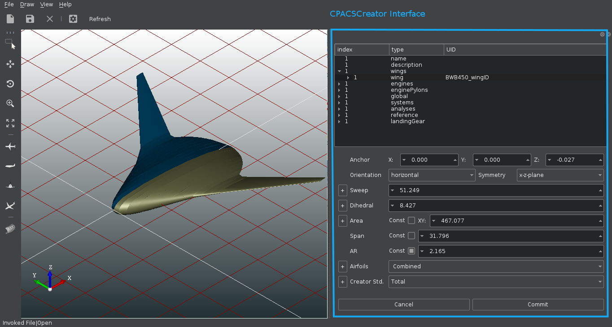

# About CPACSCreator

The CPACSCreator framework can be used for the computation, the modification 
and processing of aircraft geometries stored inside [CPACS](https://github.com/DLR-LY/CPACS) files.
CPACSCreator is build on top of the [TiGl](https://github.com/DLR-SC/tigl) project. It provides 
the same features as TiGL and add features to edit the CPACS files via high level parameters.   

TiGL offers many geometry related functions such as
 - Point retrieval functions to compute points on the aircraft surface
 - Intersection functions to compute the intersection of the aircraft with planes
 - Export functions for standard CAD file formats (STEP + IGES) or mesh formats, 
   including VTK, Collada, and STL.
 
CPACSCreator offers additional functions as:
  - Computation high level parameters of the wing as the wing aspect ratio, the wing sweep, the wing dihedral, the wing area
  - Modification of CPACS files based on the previous high level parameters 
  - Modification of the wing airfoils
  - Standardization of the description of the wing and airfoils
   

CPACSCreator framework can be divided into 3 main modules. 
  - TiGL library
  - CPACSCreatorLib
  - CPACSCreator 
  
TiGL library is the library provided by [TiGL](https://github.com/DLR-SC/tigl) project.

CPACSCreator provides the new features in a C++ library called CPACSCreatorLib. 
CPACSCrearorLib use [TIXI](https://github.com/DLR-SC/tixi) library and few functions of the TIGL library. 
CPACSCrearorLib use also [Eigen](http://eigen.tuxfamily.org/index.php?title=Main_Page) library to express
the affine transformations in matrices.

CPACSCreator viewer is based on TIGLViewer and add the features of CPACSCreatorLib into a 
user-friendly widget.    

This project was done during a Master Thesis project. You can find the master thesis report 
in doc folder or by clicking on this [link](doc/thesisreport-malodrougard-2018.pdf).
